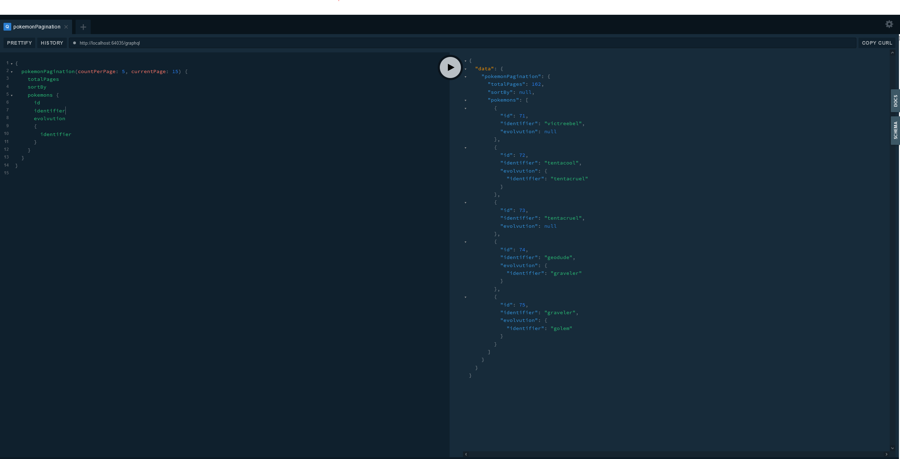

# Pokemon Graphql

Using pokemon database, generate graphql Schema from entity framework

# Tool
<ul>
  <li>Graphql</li>
  <li>Graphql Playground</li>
  <li>Entity Framework</li>
  <li>Pokedex database(https://github.com/veekun/pokedex)</li>
</ul>

# To Do
<ul>
  <li> Add more pokemon parametric data</li>
  </ul>

# Example

